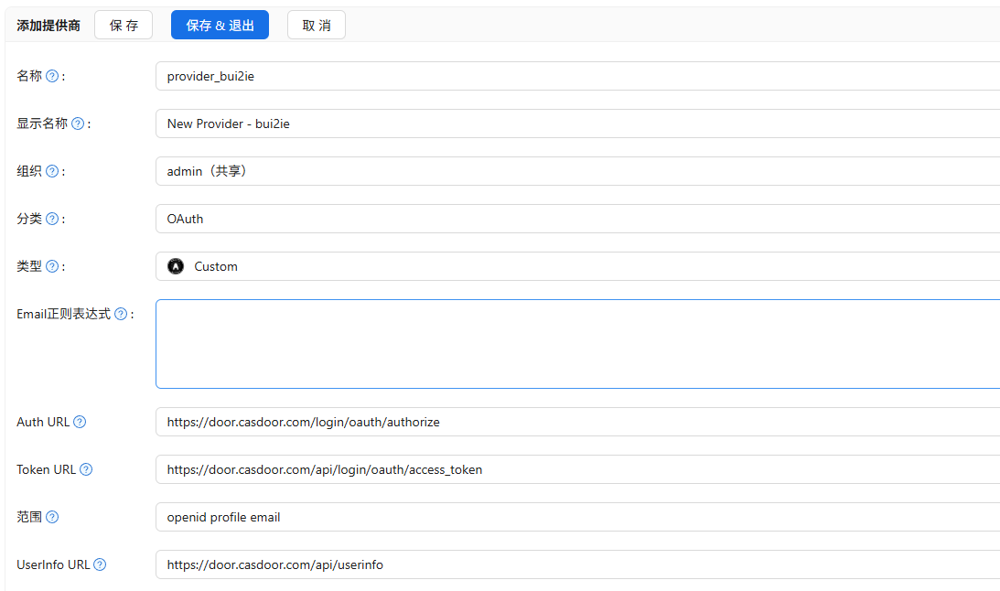
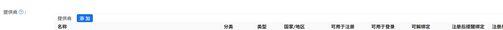

# 使用casdoor对接第三方认证系统

## 简介

casdoor支持通过OIDC协议对接第三方认证系统，如github认证。

## 配置步骤

### 添加提供商

打开casdoor的配置界面： http://{{ZGSM_BACKEND}}:{{PORT_CASDOOR}}/providers

选择`身份认证 -> 提供商 -> 添加`

在配置界面中需要将类型选择为custom，并填写Auth URL, Token url 和 UserInfo URL



用户映射可以参考

```
"id": "employee_number",
"username": "username",
"displayName": "username",
"email": "phone_number",
"avatarUrl": ""
```

这里保留三个信息，电话，工号和用户名，这样即可映射到token中

### 添加应用

身份认证 -> 应用 -> 添加 （或者使用现有的）。 在提供商这一栏中点击添加，选择刚刚生成的自定义oauth提供商



