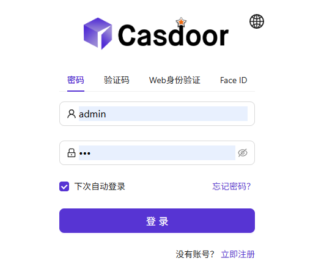
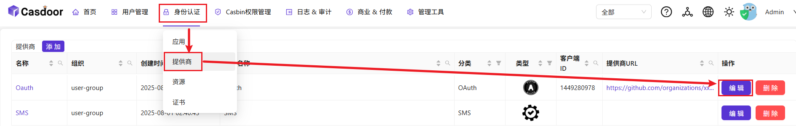
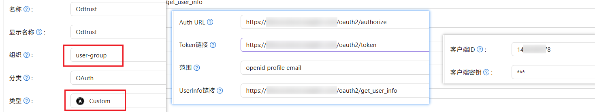
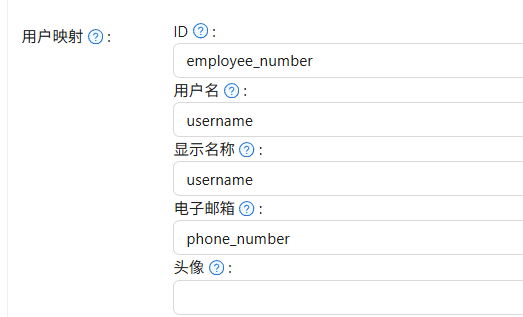
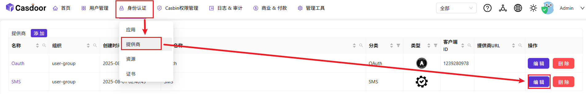
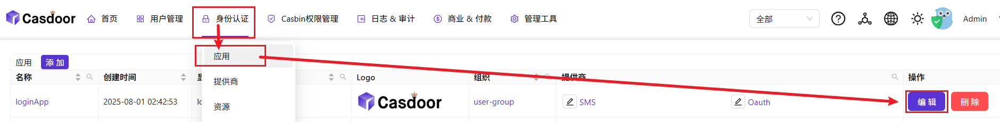
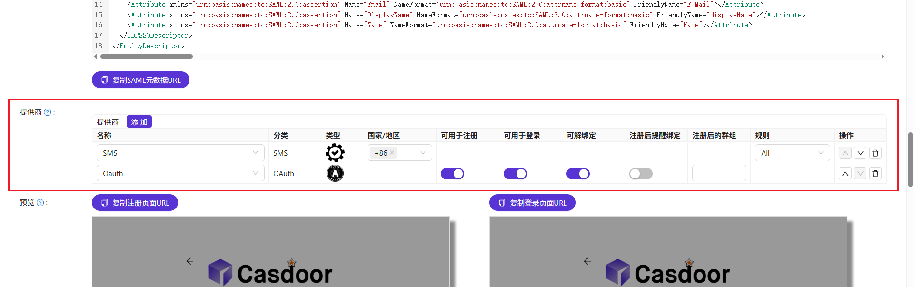

# casdoor使用文档

> 下面提及的`{host}`可以是部署了服务的主机的域名, 也可以直接是服务所在主机的ip

## 管理页面

### 管理页面访问

访问 http://{host}:8000

```commandline
默认账号： admin
默认密码： 123
```



然后进入到管理页面

#### 添加 oauth 认证服务

1. 选择身份认证 -> 提供商 -> Oauth（模板）



2. 在提供商的页面中, 组织是user-group, 类型是Custom, 修改oauth的通用配置（Auth URL、token链接、UserInfo连接、客户端ID、客户端密钥）



3. **特别需要注意的是用户映射这里**

```commandline
id 映射 -> 请求UserInfo返回的[工号/其他信息]

用户名和显示名称 映射 -> 请求UserInfo返回的[员工姓名/其他信息]

电子邮箱 映射 -> 请求UserInfo返回的[电话号/其他信息]
```



再有就是要在oauth的登录URL中添加 http://{host}/callback, （指向casdoor服务的callback路由）


### 添加 sms 认证服务

1. 首先选择身份认证 -> 提供商 -> SMS（模板）



这里只需要填写地域节点, 默认配置了一个短信认证服务, 需要在oidc-auth服务中配置对应的参数, 这里是默认对接的`https://www.shlianlu.com/console/main/homepage`短信提供商

```commandline
http://oidc-auth.costrict.svc.cluster.local:8080/oidc-auth/api/v1/send/sms
```

### 登录配置

选择身份认证 -> 应用 -> loginApp（模板）




重定向 URLs 中应将 https://{host}/oidc-auth/api/v1/plugin/login/callback  test.com 替换为您的实际域名 （/oidc-auth/* 代理到 oidc-auth 服务）

Access Token过期 和 Refresh Token过期 按需求调整

> 在提供商这里可以添加/删除 在提供商注册的认证方式


