# 登陆配置文档

## 配置页面

### 配置页面访问

访问 http://host:8000, 进入管理端登陆页面

```commandline
默认账号： admin
默认密码： 123
```
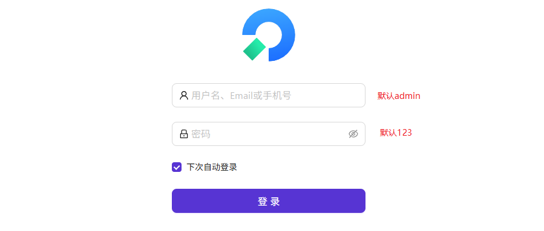

然后进入到管理页面

#### 添加 `oauth` 认证服务

选择身份认证 -> 提供商 -> `Oauth`（模板）

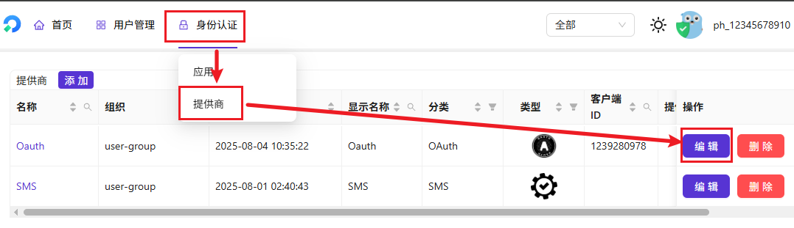

然后填写标准 `oauth` 的信息

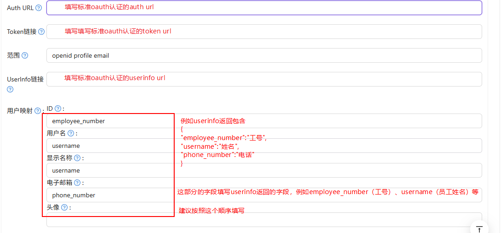

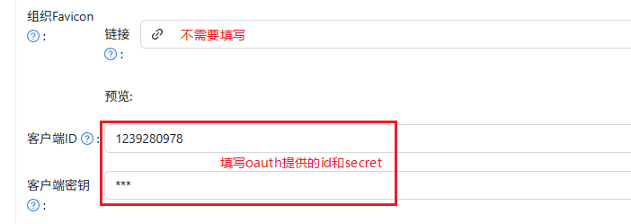

编辑完成拉到最下面点击 `保存 & 退出`

### 添加 sms 认证服务

首先选择身份认证 -> 提供商 -> SMS（模板）

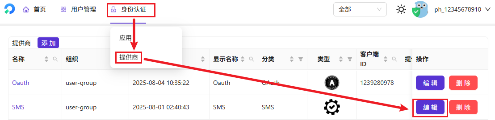

只需要填写地域节点配置

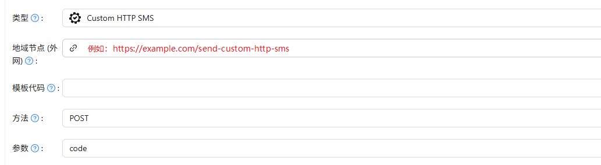

### 登录配置

首先看下正常启用的用户登陆页面

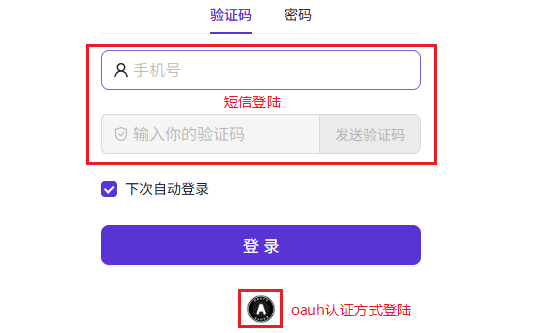

密码登陆是测试使用的, 内置了一个可以直接使用的账号密码

```commandline
账号： demo
密码： test123
```

配置登陆：选择身份认证 -> 应用 -> loginApp（模板）

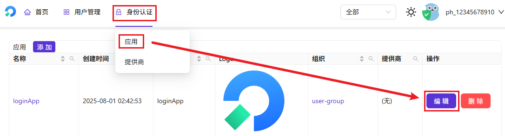

首先修改登陆页面的图标

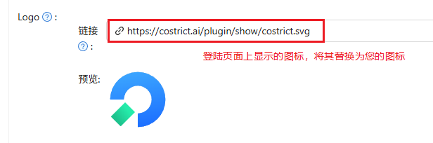

点击删除按钮去掉密码登陆方式

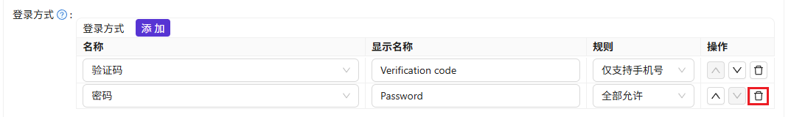

也可以去除oauth登陆方式（短信验证哪里是无法去除的）

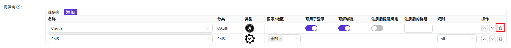

配置完成后拉到页面的最下方点击 `保存 & 退出`

## 组织配置

> 这里主要用来配置图标和title名字

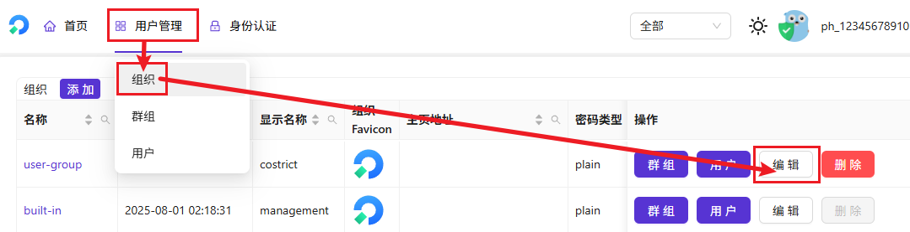

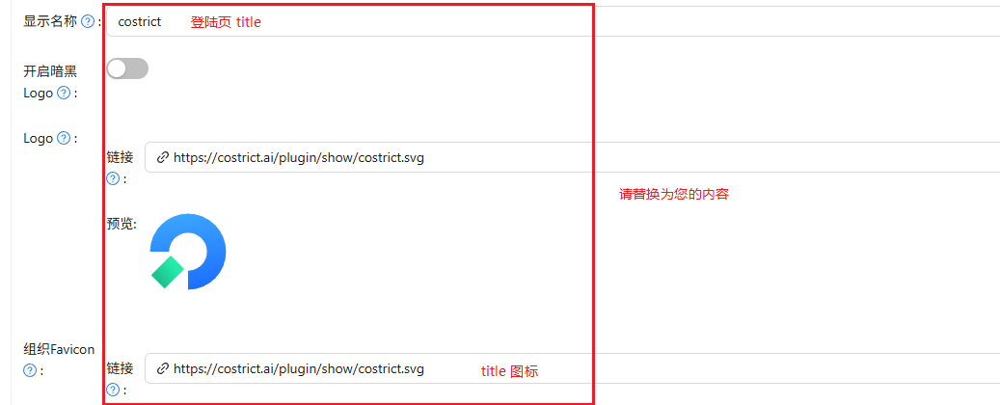

`built-in` 中的显示名称也请和user-group的一致, `logo` 和 `组织Favicon` 请替换为您自己的
